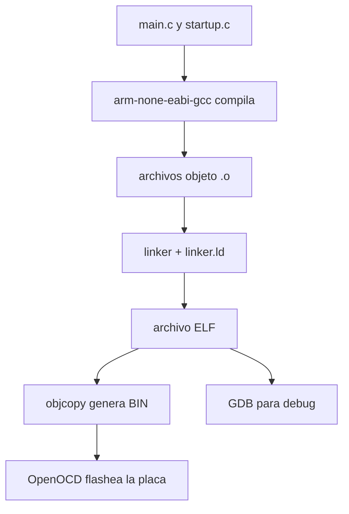

# Toolchain bare-metal para Blue Pill

Esta guía resume las herramientas involucradas en el flujo de compilación, enlace, flashing y depuración del proyecto.

## Qué es una toolchain

Una toolchain es el conjunto de programas que transforma el código fuente en un binario ejecutable para el microcontrolador.

En este proyecto intervienen principalmente:

- `arm-none-eabi-gcc`
- `make`
- `openocd`
- `gdb-multiarch`

## Flujo general



## Herramientas principales

### `arm-none-eabi-gcc`

Cumple dos funciones.

#### Compilación

Transforma cada `.c` en un archivo objeto `.o`:

```bash
arm-none-eabi-gcc -c -mcpu=cortex-m3 -g -o obj/main.o src/main.c
```

#### Enlace

Toma todos los `.o`, aplica `linker.ld` y genera el ejecutable final:

```bash
arm-none-eabi-gcc -T linker.ld -nostartfiles -Wl,-Map=bin/blink.map -o bin/blink.elf obj/*.o
```

El resultado es un archivo `.elf` con código, datos y símbolos de depuración.

### `linker.ld`

Define:

- cuánta Flash y RAM tiene el micro,
- dónde se ubica cada sección,
- qué símbolos exporta para el startup.

Más detalle en [linker.md](linker.md).

### `arm-none-eabi-objcopy`

Extrae un binario crudo desde el `.elf`:

```bash
arm-none-eabi-objcopy -O binary bin/blink.elf bin/blink.bin
```

Ese `.bin` es útil para flashing cuando no se necesitan símbolos de debug.

### `OpenOCD`

Programa el firmware en la Flash del STM32 a través de un ST-Link.

Ejemplo:

```bash
openocd -f interface/stlink.cfg -f target/stm32f1x.cfg -c "program bin/blink.elf verify reset exit"
```

También puede ejecutarse como servidor para depuración con GDB:

```bash
openocd -f interface/stlink.cfg -f target/stm32f1x.cfg
```

### `gdb-multiarch`

Permite depurar el ELF usando OpenOCD como backend remoto:

```bash
gdb-multiarch bin/blink.elf
```

Comandos típicos:

```gdb
(gdb) target remote localhost:3333
(gdb) break main
(gdb) continue
```

### `make`

Automatiza el flujo completo. En este repo se usa para:

- compilar,
- enlazar,
- generar `.elf`, `.bin` y `.map`,
- flashear,
- abrir sesiones de debug.

Comandos comunes:

```bash
make
make flash
make gdb
make clean
```

## Por qué conviene entender esta cadena

Entender la toolchain permite:

- diagnosticar errores de compilación o linker,
- saber qué archivo mirar cuando algo falla,
- modificar el flujo con más criterio,
- integrar otras bibliotecas o un RTOS sin tratar la build como una caja negra.

## Lecturas relacionadas

- [startup.md](startup.md)
- [linker.md](linker.md)
- [main.md](main.md)
- [README.md](../README.md)
